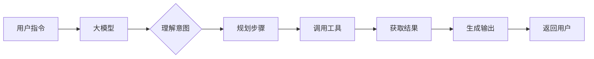
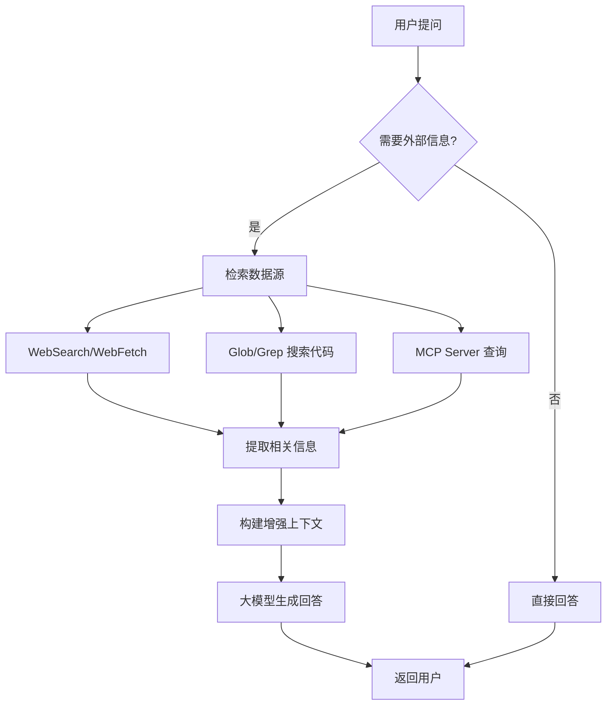
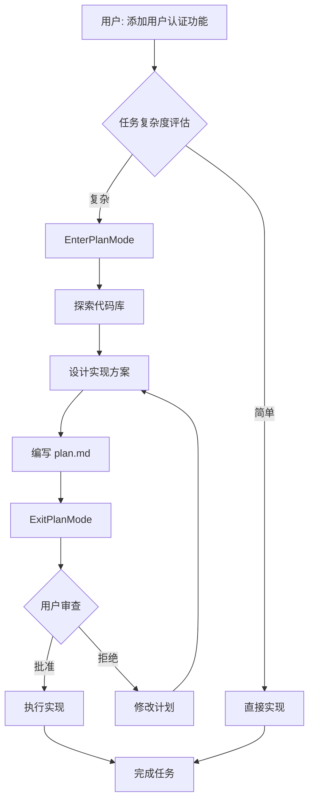
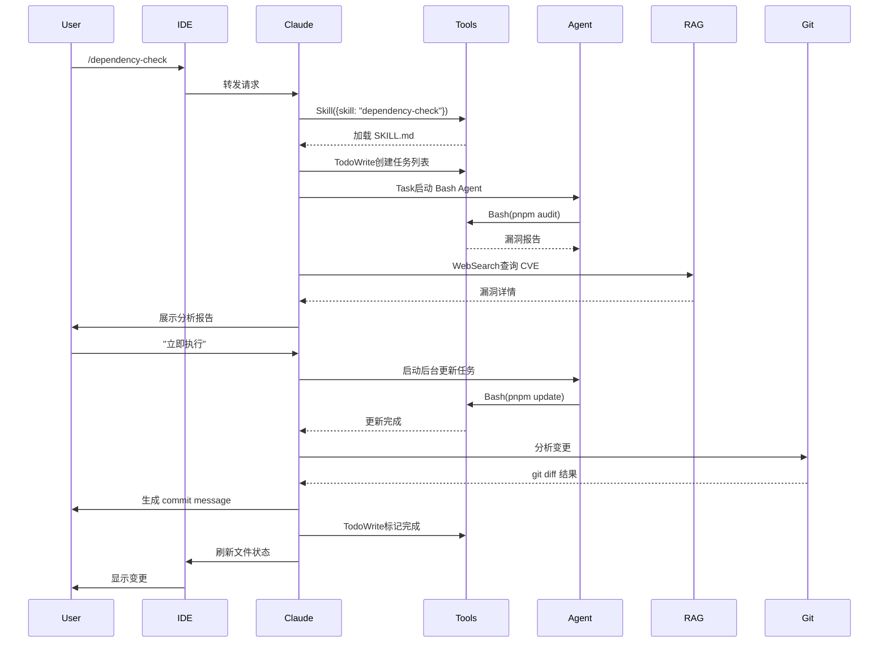

# Claude Code 完整技术架构文档

> **版本**: v1.0
> **更新日期**: 2026-02-08
> **作者**: Claude Sonnet 4.5

---

## 📑 目录

- [概述](#概述)
- [核心组件](#核心组件)
  - [1. 大模型 (LLM)](#1-大模型-llm)
  - [2. Agent（智能代理）](#2-agent智能代理)
  - [3. MCP (Model Context Protocol)](#3-mcp-model-context-protocol)
  - [4. Skill（技能）](#4-skill技能)
  - [5. RAG (检索增强生成)](#5-rag-检索增强生成)
- [扩展组件](#扩展组件)
  - [6. Tools（工具系统）](#6-tools工具系统)
  - [7. Context Management（上下文管理）](#7-context-management上下文管理)
  - [8. Hooks（钩子系统）](#8-hooks钩子系统)
  - [9. Plan Mode（规划模式）](#9-plan-mode规划模式)
  - [10. Permission & Security（权限与安全）](#10-permission--security权限与安全)
  - [11. Session Management（会话管理）](#11-session-management会话管理)
  - [12. Settings & Configuration（配置系统）](#12-settings--configuration配置系统)
  - [13. Git Integration（Git 集成）](#13-git-integrationgit-集成)
  - [14. IDE Integration（IDE 集成）](#14-ide-integrationide-集成)
- [完整架构图](#完整架构图)
- [协同工作流程](#协同工作流程)
- [组件重要性评级](#组件重要性评级)
- [实际应用案例](#实际应用案例)

---

## 概述

Claude Code 是 Anthropic 官方推出的 AI 编程助手 CLI 工具，采用多层次、模块化的架构设计，通过多个专业化组件的协同工作，实现强大的代码理解、生成和操作能力。

**核心特点**：
- 🧠 **智能化**: 基于 Claude 系列大模型的强大理解能力
- 🔧 **模块化**: 各组件职责清晰，易于扩展和维护
- 🔒 **安全性**: 多层安全机制，防止危险操作
- 🔄 **可扩展**: 支持自定义 Skills、MCP Servers 和 Hooks
- 📊 **上下文感知**: 智能管理对话历史，支持无限长度会话

---

## 核心组件

### 1. 大模型 (LLM)

#### 作用
Claude Code 的核心智能引擎，提供自然语言理解和代码生成能力。

#### 可用模型

| 模型 | 模型 ID | 用途 | 特点 |
|------|--------|------|------|
| **Claude Sonnet 4.5** | claude-sonnet-4-5 | 主力模型 | 平衡性能和成本，适合大多数任务 |
| **Claude Opus 4.6** | claude-opus-4-6 | 复杂任务 | 最强推理能力，处理困难问题 |
| **Claude Haiku** | claude-haiku | 快速响应 | 轻量级模型，快速处理简单任务 |

#### 工作方式



**核心能力**：
- 自然语言理解和意图识别
- 任务规划和步骤分解
- 工具调用决策
- 代码生成和修改
- 错误分析和调试建议

---

### 2. Agent（智能代理）

#### 作用
专门化的子任务执行器，具有特定能力的 AI 助手。每个 Agent 都有专门的工具集和职责范围。

#### Agent 类型

```
📦 Claude Code 中的 Agent 类型
│
├── Bash Agent
│   ├── 工具: Bash
│   └── 职责: 命令行操作、系统命令执行
│
├── Explore Agent
│   ├── 工具: Glob, Grep, Read, WebFetch, WebSearch
│   └── 职责: 代码库探索、文件搜索、内容查询
│
├── Plan Agent
│   ├── 工具: 所有只读工具
│   └── 职责: 软件架构设计、实现计划制定
│
├── General-Purpose Agent
│   ├── 工具: 全部工具
│   └── 职责: 通用任务处理、复杂多步骤操作
│
└── claude-code-guide Agent
    ├── 工具: Glob, Grep, Read, WebFetch, WebSearch
    └── 职责: Claude Code 使用指南、功能说明
```

#### 工作方式

1. **启动**: 主 Claude 实例使用 `Task` 工具启动 Agent
2. **执行**: Agent 在独立会话中自主工作
3. **返回**: Agent 完成后返回结果给主实例
4. **并行**: 多个 Agent 可同时运行，提高效率

**示例代码**：
```javascript
// 主 Claude 启动 Explore Agent
Task({
  subagent_type: "Explore",
  prompt: "Find all error handling code in the project",
  description: "Search error handling"
})
```

---

### 3. MCP (Model Context Protocol)

#### 作用
连接外部服务的标准协议，让 Claude Code 能访问各种数据源和 API。

#### MCP 架构

```
┌─────────────────────────────────────────┐
│         Claude Code (Client)            │
└─────────────────────────────────────────┘
                 ↓ MCP Protocol
┌─────────────────────────────────────────┐
│          MCP Servers (多个)              │
│  ┌────────────┐  ┌────────────┐         │
│  │  GitHub    │  │ Confluence │         │
│  │  Server    │  │  Server    │  ...    │
│  └────────────┘  └────────────┘         │
└─────────────────────────────────────────┘
                 ↓
┌─────────────────────────────────────────┐
│       External Services & APIs          │
└─────────────────────────────────────────┘
```

#### 常见 MCP Servers

| Server | 用途 | 提供的能力 |
|--------|------|-----------|
| **GitHub MCP** | GitHub 集成 | PR 查看、Issue 管理、仓库操作 |
| **Confluence MCP** | 企业知识库 | 文档检索、页面创建 |
| **Jira MCP** | 项目管理 | 任务查询、状态更新 |
| **Database MCP** | 数据库访问 | SQL 查询、数据分析 |
| **Slack MCP** | 团队协作 | 消息发送、频道管理 |

#### 配置示例

```json
{
  "mcpServers": {
    "github": {
      "command": "mcp-server-github",
      "env": {
        "GITHUB_TOKEN": "${GITHUB_TOKEN}"
      }
    },
    "confluence": {
      "command": "mcp-server-confluence",
      "args": ["--base-url", "https://company.atlassian.net"],
      "env": {
        "CONFLUENCE_TOKEN": "${CONFLUENCE_TOKEN}"
      }
    }
  }
}
```

---

### 4. Skill（技能）

#### 作用
可复用的专业提示词模板，封装最佳实践和领域知识。

#### Skill 结构

```
.claude/skills/
├── code-health/
│   ├── SKILL.md           # 主技能定义
│   └── references/        # 参考文档
├── dependency-check/
│   └── SKILL.md
└── frontend-review/
    ├── SKILL.md
    └── references/
        ├── html-standards.md
        ├── javascript-standards.md
        └── css-standards.md
```

#### Skill 定义示例

```markdown
# Dependency Health Check

## When to use this skill
Use this skill when you need to:
- Audit dependencies for security vulnerabilities
- Update packages to latest versions
- Find and remove unused dependencies

## Supported package managers
- npm/yarn/pnpm (package.json)
- pip (requirements.txt)
- cargo (Cargo.toml)
- go mod (go.mod)

## Analysis checklist
1. Security vulnerabilities: Check for known CVEs
2. Outdated versions: Identify available updates
3. Unused dependencies: Scan code for actual usage
4. Deprecated packages: Find unmaintained packages

## Output format
[详细的输出格式说明...]
```

#### 调用方式

```bash
# 命令行调用
/code-health
/dependency-check
/frontend-review src/components

# 代码调用
Skill({
  skill: "dependency-check",
  args: "package.json"
})
```

---

### 5. RAG (检索增强生成)

#### 作用
增强大模型的知识检索能力，让 AI 能访问最新和专业的信息，解决知识截止日期和幻觉问题。

#### RAG 工作流程



#### RAG 数据源

| 数据源 | 工具 | 用途 | 示例 |
|--------|------|------|------|
| **互联网** | WebSearch | 最新技术文档、CVE 漏洞信息 | "Vue 3.5 新特性" |
| **网页** | WebFetch | 特定文档页面内容 | "https://vuejs.org/api" |
| **代码库** | Glob/Grep | 项目文件、代码片段 | "错误处理逻辑" |
| **企业知识库** | MCP Servers | 内部文档、API 规范 | Confluence 文档 |
| **项目文件** | Read | README、配置文件 | package.json 依赖 |

#### RAG 实例

**用户提问**：
```
"axios 1.11.0 有什么安全漏洞？"
```

**RAG 流程**：
1. 识别需要外部信息
2. 使用 WebSearch 查询 "axios 1.11.0 CVE vulnerability"
3. 提取搜索结果中的 CVE 编号和描述
4. 大模型基于检索内容生成准确答案

**回答**：
```
axios 1.11.0 存在 HIGH 严重性的 DoS 漏洞 (CVE-2024-XXXXX)：
- 影响：攻击者可发送恶意请求导致服务拒绝
- 修复版本：axios@1.13.5
- 建议：立即升级
```

---

## 扩展组件

### 6. Tools（工具系统）

#### 作用
Claude Code 的"手脚"，所有实际操作都通过 Tools 完成。

#### 工具分类

```
📦 Claude Code 工具箱
│
├── 📁 文件操作工具
│   ├── Read
│   │   ├── 功能: 读取文件内容
│   │   ├── 支持: 文本、PDF、图片、Jupyter Notebook
│   │   └── 示例: Read({file_path: "package.json"})
│   │
│   ├── Write
│   │   ├── 功能: 创建新文件
│   │   └── 注意: 必须先用 Read 读取现有文件
│   │
│   ├── Edit
│   │   ├── 功能: 精确替换文件内容
│   │   ├── 参数: file_path, old_string, new_string
│   │   └── 特点: 支持 replace_all 模式
│   │
│   ├── Glob
│   │   ├── 功能: 文件模式匹配搜索
│   │   ├── 示例: Glob({pattern: "**/*.js"})
│   │   └── 特点: 快速、支持复杂模式
│   │
│   └── Grep
│       ├── 功能: 内容搜索（基于 ripgrep）
│       ├── 模式: files_with_matches, content, count
│       └── 特点: 支持正则、多行匹配
│
├── 💻 执行工具
│   ├── Bash
│   │   ├── 功能: 执行命令行命令
│   │   ├── 超时: 默认 2 分钟，最长 10 分钟
│   │   └── 安全: 沙箱模式、危险命令拦截
│   │
│   ├── TaskOutput
│   │   ├── 功能: 获取后台任务输出
│   │   └── 参数: task_id, block, timeout
│   │
│   └── TaskStop
│       ├── 功能: 停止后台任务
│       └── 参数: task_id
│
├── 🌐 网络工具
│   ├── WebSearch
│   │   ├── 功能: 搜索引擎查询
│   │   ├── 地区: 仅美国可用
│   │   └── 过滤: allowed_domains, blocked_domains
│   │
│   └── WebFetch
│       ├── 功能: 获取网页内容
│       ├── 格式: HTML → Markdown
│       └── 缓存: 15 分钟自动清理
│
├── 🤖 协作工具
│   ├── Task
│   │   ├── 功能: 启动子 Agent
│   │   ├── 参数: subagent_type, prompt, model
│   │   └── 模式: 同步/后台运行
│   │
│   ├── Skill
│   │   ├── 功能: 调用预定义技能
│   │   └── 示例: Skill({skill: "code-health"})
│   │
│   └── AskUserQuestion
│       ├── 功能: 向用户提问
│       ├── 支持: 单选、多选、自定义输入
│       └── 用途: 收集需求、澄清意图
│
├── 📋 任务管理工具
│   └── TodoWrite
│       ├── 功能: 管理任务列表
│       ├── 状态: pending, in_progress, completed
│       └── 展示: 实时更新进度
│
└── 🎯 模式切换工具
    ├── EnterPlanMode
    │   ├── 功能: 进入规划模式
    │   └── 用途: 复杂任务的方案设计
    │
    └── ExitPlanMode
        ├── 功能: 退出规划模式
        └── 效果: 请求用户批准计划
```

#### 工具调用流程

```javascript
// 1. 大模型决定调用工具
// 2. 系统执行工具
const result = Read({file_path: "package.json"})

// 3. 返回结果给大模型
// 4. 大模型根据结果决定下一步
```

**工具使用最佳实践**：
- 优先使用专用工具（Read）而非通用命令（Bash cat）
- 并行调用独立工具以提高效率
- 为复杂搜索任务使用 Task + Explore Agent

---

### 7. Context Management（上下文管理）

#### 作用
管理对话历史，确保 AI 能理解完整的上下文，同时控制 token 消耗。

#### 上下文管理策略

```
🧠 上下文管理架构
│
├── 自动总结（Automatic Summarization）
│   ├── 触发条件: 对话接近 token 限制
│   ├── 保留内容:
│   │   ├── 用户明确指令
│   │   ├── 关键文件路径
│   │   ├── 错误信息和修复方案
│   │   └── 任务完成状态
│   └── 丢弃内容:
│       ├── 重复的工具输出
│       ├── 中间调试信息
│       └── 已解决的临时问题
│
├── 无限上下文（Unlimited Context）
│   ├── 实现: 通过自动总结实现"无限"对话长度
│   ├── 存储: .compacted.jsonl 文件
│   └── 恢复: 可从总结恢复会话上下文
│
├── 上下文优先级
│   ├── 系统提示词: 最高优先级（始终保留）
│   ├── 最近消息: 高优先级（保留最近 N 轮）
│   ├── 工具结果: 中优先级（相关结果保留）
│   └── 历史总结: 低优先级（压缩保存）
│
└── 文件存储
    ├── <session-id>.jsonl - 完整对话历史
    └── <session-id>.compacted.jsonl - 压缩历史
```

#### 总结示例

**原始对话**（1000+ 行）:
```
User: 修复这个 bug
Assistant: 让我先读取文件...
<Read file>
<结果 500 行>
Assistant: 发现问题了...
<Edit file>
...
```

**压缩后**（50 行）:
```
Summary:
- User requested to fix authentication bug in src/auth.js:42
- Issue: Missing null check before accessing user.token
- Fix applied: Added null guard and error handling
- Result: Bug fixed, tests passing
```

---

### 8. Hooks（钩子系统）

#### 作用
允许用户在特定事件触发时自动执行命令，实现工作流自动化。

#### 钩子类型

| 钩子名称 | 触发时机 | 常见用途 |
|---------|---------|---------|
| `user-prompt-submit-hook` | 用户提交消息前 | 显示 git status, 检查未提交变更 |
| `tool-call-hook` | 每次工具调用时 | 记录操作日志, 统计工具使用 |
| `session-start-hook` | 会话开始时 | 显示项目信息, 检查环境 |
| `session-end-hook` | 会话结束时 | 生成工作总结, 清理临时文件 |

#### 配置示例

```json
{
  "hooks": {
    "user-prompt-submit-hook": "git status --short && echo '---'",
    "tool-call-hook": "echo '[$(date)] Tool: {{tool_name}}' >> .claude/tool-log.txt",
    "session-start-hook": "git log -1 --oneline && npm run test:unit",
    "session-end-hook": "echo 'Session ended at $(date)' && git stash"
  }
}
```

#### 钩子变量

钩子命令中可使用的变量：
- `{{tool_name}}` - 调用的工具名称
- `{{file_path}}` - 操作的文件路径
- `{{timestamp}}` - 当前时间戳

#### 实际应用场景

**场景 1: 提交前检查**
```json
{
  "user-prompt-submit-hook": "npm run lint && npm test"
}
```

**场景 2: 操作审计**
```json
{
  "tool-call-hook": "echo '$(date): {{tool_name}}' >> audit.log"
}
```

**场景 3: 环境初始化**
```json
{
  "session-start-hook": "docker-compose up -d && npm install"
}
```

---

### 9. Plan Mode（规划模式）

#### 作用
专门用于复杂任务的规划阶段，确保实现方案得到用户批准后再执行。

#### 工作流程



#### Plan Mode 特点

**限制**：
- ✅ 可以使用：Read, Glob, Grep, WebSearch, WebFetch
- ❌ 不能使用：Edit, Write, Bash, NotebookEdit

**目的**：
- 防止在理解需求前就开始编码
- 确保技术方案得到用户认可
- 评估风险和依赖关系

#### 计划文档模板

```markdown
# 实现计划：[功能名称]

## 1. 需求分析
- 用户需求：...
- 技术要求：...
- 限制条件：...

## 2. 架构决策
- 技术选型：...
- 设计模式：...
- 数据流：...

## 3. 需要修改的文件
- [ ] src/router/index.js - 添加路由守卫
- [ ] src/store/user.js - 实现用户状态管理
- [ ] src/api/auth.js - 创建认证 API

## 4. 实现步骤
1. 第一步：...
2. 第二步：...
3. 第三步：...

## 5. 风险评估
- ⚠️ 风险 1：需要后端 API 配合
- ⚠️ 风险 2：可能影响现有路由

## 6. 测试计划
- [ ] 单元测试
- [ ] 集成测试
- [ ] E2E 测试

## 7. 回滚方案
如果出现问题：...
```

---

### 10. Permission & Security（权限与安全）

#### 作用
保护用户系统，防止危险操作，确保所有修改都在用户控制下。

#### 安全机制

```
🔒 多层安全防护
│
├── 1️⃣ Sandbox Mode（沙箱模式）
│   ├── 文件访问限制
│   │   ├── 仅限项目目录
│   │   ├── 白名单机制
│   │   └── 敏感文件保护（.env, .git/）
│   │
│   └── 命令限制
│       ├── 禁止: rm -rf /, dd, mkfs, format
│       ├── 警告: git reset --hard, git clean -f
│       └── 需确认: npm publish, docker rm -f
│
├── 2️⃣ Permission Prompts（权限请求）
│   ├── 首次执行时请求
│   ├── 敏感操作前确认
│   └── 可配置自动批准
│
├── 3️⃣ Git Safety Protocol（Git 安全协议）
│   ├── ❌ 不修改 git config
│   ├── ❌ 不跳过 hooks（--no-verify）
│   ├── ❌ 不 force push to main/master
│   ├── ✅ Pre-commit 失败后创建新 commit
│   └── ✅ 破坏性操作需明确指令
│
├── 4️⃣ File Protection（文件保护）
│   ├── 敏感文件提示
│   │   ├── .env, .env.*
│   │   ├── credentials.json
│   │   ├── *_rsa, *.pem
│   │   └── api-keys.txt
│   │
│   └── 只读文件保护
│       ├── node_modules/
│       ├── .git/objects/
│       └── 系统文件
│
└── 5️⃣ Dangerous Commands Blocking
    ├── 完全阻止
    │   ├── rm -rf /
    │   ├── dd if=/dev/zero
    │   ├── :(){ :|:& };:
    │   └── chmod -R 777 /
    │
    └── 需要确认
        ├── docker system prune -a
        ├── npm publish
        └── git push --force
```

#### 安全配置

```json
{
  "security": {
    "sandboxMode": true,
    "autoApprove": {
      "read": true,
      "write": false,
      "bash": false
    },
    "blockedCommands": [
      "rm -rf /",
      "dd if=/dev/zero",
      "mkfs"
    ],
    "protectedFiles": [
      ".env",
      "*.pem",
      "credentials.json"
    ]
  }
}
```

---

### 11. Session Management（会话管理）

#### 作用
管理不同的工作会话和状态持久化，支持跨设备访问和团队协作。

#### 会话类型

```
📂 会话管理架构
│
├── 本地会话（Local Session）
│   ├── 存储位置:
│   │   └── ~/.claude/projects/<project-hash>/
│   │       ├── <session-id>.jsonl
│   │       ├── <session-id>.compacted.jsonl
│   │       └── tasks/
│   │           └── <task-id>.output
│   │
│   ├── 内容:
│   │   ├── 完整对话历史
│   │   ├── 工具调用记录
│   │   ├── 后台任务输出
│   │   └── 会话元数据
│   │
│   └── 持久化: 永久保存
│
├── 远程会话（Remote Session）
│   ├── 存储位置: claude.ai 云端
│   ├── 用途:
│   │   ├── 跨设备访问
│   │   ├── 团队协作
│   │   └── 会话分享
│   │
│   └── 推送: /push 命令
│
└── 临时会话（Ephemeral Session）
    ├── 用途: 快速测试、演示
    ├── 特点: 不保存历史
    └── 销毁: 进程结束时自动清理
```

#### 会话命令

```bash
# 列出所有会话
claude sessions

# 恢复会话
claude --session <session-id>

# 推送到远程
/push

# 清理旧会话
claude sessions clean --older-than 30d
```

#### 会话文件结构

```
~/.claude/projects/
└── e--ProjectxPlex-WebCodePlex-WebExamples/
    ├── a533e3fa-5274-4e93-baca-5cc0ed316894.jsonl
    ├── a533e3fa-5274-4e93-baca-5cc0ed316894.compacted.jsonl
    └── tasks/
        ├── bb2bb8f.output
        └── cc3cc9g.output
```

---

### 12. Settings & Configuration（配置系统）

#### 作用
管理 Claude Code 的行为和偏好设置，支持项目级和用户级配置。

#### 配置优先级

```
⚙️ 配置层级（优先级从高到低）
│
├── 1️⃣ 项目配置
│   ├── .clauderc.json
│   ├── .claude/config.json
│   └── .claude/skills/
│
├── 2️⃣ 用户配置
│   ├── ~/.claude/config.json
│   └── ~/.claude/skills/
│
└── 3️⃣ 默认配置
    └── 内置默认值
```

#### 完整配置示例

```json
{
  "model": "sonnet",
  "autoApprove": {
    "read": true,
    "write": false,
    "bash": false
  },
  "hooks": {
    "user-prompt-submit-hook": "git status --short",
    "tool-call-hook": "echo 'Tool: {{tool_name}}'",
    "session-start-hook": "npm test",
    "session-end-hook": "git stash"
  },
  "mcpServers": {
    "github": {
      "command": "mcp-server-github",
      "env": {
        "GITHUB_TOKEN": "${GITHUB_TOKEN}"
      }
    },
    "confluence": {
      "command": "mcp-server-confluence",
      "args": ["--base-url", "https://company.atlassian.net"],
      "env": {
        "CONFLUENCE_TOKEN": "${CONFLUENCE_TOKEN}"
      }
    }
  },
  "skills": {
    "directories": [
      "./.claude/skills",
      "~/.claude/skills"
    ]
  },
  "security": {
    "sandboxMode": true,
    "protectedFiles": [".env", "*.pem"]
  },
  "git": {
    "autoCommit": false,
    "coAuthor": "Claude Sonnet 4.5 <noreply@anthropic.com>"
  }
}
```

#### 配置项说明

| 配置项 | 类型 | 默认值 | 说明 |
|--------|------|--------|------|
| `model` | string | "sonnet" | 默认使用的模型 |
| `autoApprove` | object | {...} | 自动批准设置 |
| `hooks` | object | {} | 钩子配置 |
| `mcpServers` | object | {} | MCP 服务器配置 |
| `skills.directories` | array | [...] | Skills 搜索路径 |
| `security.sandboxMode` | boolean | true | 沙箱模式 |
| `git.coAuthor` | string | ... | Git commit 共同作者 |

---

### 13. Git Integration（Git 集成）

#### 作用
提供智能的 Git 操作支持，自动生成符合规范的 commit message。

#### Git 工作流

```
🌳 智能 Git 工作流
│
├── 1️⃣ 智能 Commit
│   ├── 分析变更
│   │   ├── git status
│   │   ├── git diff（staged & unstaged）
│   │   └── git log（学习风格）
│   │
│   ├<|2024-01-placeholder-continuation-marker|>能 Git 操作的详细说明
   └── 添加 Co-Authored-By 标签
│
├── 2️⃣ Pull Request 创建
│   ├── 分析整个分支
│   │   ├── git log base-branch...HEAD
│   │   ├── git diff base-branch...HEAD
│   │   └── 统计变更文件
│   │
│   ├── 生成 PR 内容
│   │   ├── 标题: 简洁描述（<70 字符）
│   │   ├── 描述: 变更摘要
│   │   └── 测试计划: 验证步骤
│   │
│   └── 使用 gh CLI
│       └── gh pr create --title "..." --body "..."
│
├── 3️⃣ Git 安全协议
│   ├── ❌ 不修改 git config
│   ├── ❌ 不跳过 hooks
│   ├── ❌ 不 force push to main
│   ├── ✅ Pre-commit 失败后创建新 commit（不 amend）
│   └── ✅ 破坏性操作需明确指令
│
└── 4️⃣ GitHub CLI 集成
    ├── gh pr view/create/list
    ├── gh issue view/create
    ├── gh repo view
    └<|2024-01-placeholder-continuation-marker|>> gh api（自定义 API 调用）
```

#### Commit Message 生成

**分析输入**：
```bash
# 1. git status
modified:   src/auth.js
modified:   tests/auth.test.js
added:      docs/auth-api.md

# 2. git diff
+function validateToken(token) {
+  if (!token) throw new Error('Token required')
+  return jwt.verify(token, SECRET_KEY)
+}
```

**生成输出**：
```
feat: Add token validation in authentication module

- Implement validateToken function with null check
- Add JWT verification with error handling
- Update tests to cover new validation logic
- Add API documentation for authentication endpoints

Co-Authored-By: Claude Sonnet 4.5 <noreply@anthropic.com>
```

---

### 14. IDE Integration（IDE 集成）

#### 作用
在 VSCode 中提供原生体验，增强开发者工作流。

#### VSCode 扩展功能

```
🎨 VSCode 集成特性
│
├── 📍 代码引用
│   ├── 点击跳转
│   │   ├── [file.js:42](path#L42)
│   │   └── 跳转到精确行号
│   │
│   ├── 选中上下文
│   │   ├── 自动包含选中代码
│   │   └── 提供上下文分析
│   │
│   └── Markdown 链接
│       └── 支持相对路径和行号范围
│
├── 🖥️ UI 增强
│   ├── 侧边栏面板
│   │   ├── 对话历史
│   │   ├── 任务进度
│   │   └── Skills 列表
│   │
│   ├── 内联建议
│   │   ├<|2024-01-placeholder-continuation-marker|>代码补全
│   │   └── 错误修复建议
│   │
│   └── 状态栏
│       ├── 当前 Agent 状态
│       └── Token 使用量
│
├── ⌨️ 快捷键
│   ├── Ctrl+Shift+P: 打开 Claude
│   ├── Ctrl+K C: 询问选中代码
│   └── Ctrl+K F: 修复选中代码
│
└── 🔄 实时协作
    ├── 文件变更实时同步
    ├── 任务进度可视化
    └── 错误提示集成
```

#### 代码引用格式

```markdown
<!-- 文件引用 -->
查看 [package.json](package.json)

<!-- 行号引用 -->
问题在 [auth.js:42](src/auth.js#L42)

<!-- 范围引用 -->
相关代码 [utils.js:10-25](src/utils.js#L10-L25)

<!-- 文件夹引用 -->
检查 [组件目录](src/components/)
```

---

## 完整架构图

### 整体架构

```
┌─────────────────────────────────────────────────────────────────┐
│                        用户层 (User Layer)                       │
│  ┌────────────┐  ┌────────────┐  ┌────────────┐                │
│  │  CLI 终端  │  │ VSCode IDE │  │ Web 界面   │                │
│  └────────────┘  └────────────┘  └────────────┘                │
└─────────────────────────────────────────────────────────────────┘
                            ↓
┌─────────────────────────────────────────────────────────────────┐
│              配置 & 安全层 (Config & Security)                   │
│  Settings | Permissions | Hooks | Git Safety | Sandbox          │
└─────────────────────────────────────────────────────────────────┘
                            ↓
┌─────────────────────────────────────────────────────────────────┐
│            上下文管理层 (Context Management)                     │
│  Context Management | Session Management | History Compaction   │
└─────────────────────────────────────────────────────────────────┘
                            ↓
┌─────────────────────────────────────────────────────────────────┐
│                  核心 AI 引擎 (Core AI Engine)                  │
│  ┌───────────────────────────────────────────────────────────┐ │
│  │       Large Language Model (Claude Sonnet 4.5)            │ │
│  │       • 意图理解  • 任务规划  • 工具调用决策               │ │
│  └───────────────────────────────────────────────────────────┘ │
└─────────────────────────────────────────────────────────────────┘
         ↓             ↓             ↓             ↓
┌──────────────┐ ┌──────────────┐ ┌──────────────┐ ┌──────────────┐
│   Tools      │ │   Agents     │ │   Skills     │ │     MCP      │
│   系统       │ │   系统       │ │   系统       │ │    协议      │
│              │ │              │ │              │ │              │
│ • Read       │ │ • Bash       │ │ • code-      │ │ • GitHub     │
│ • Write      │ │ • Explore    │ │   health     │ │ • Confluence │
│ • Edit       │ │ • Plan       │ │ • dependency │ │ • Database   │
│ • Bash       │ │ • General    │ │ • frontend   │ │ • Custom     │
│ • Glob       │ │ • Guide      │ │   review     │ │              │
│ • Grep       │ │              │ │              │ │              │
└──────────────┘ └──────────────┘ └──────────────┘ └──────────────┘
         ↓             ↓             ↓             ↓
┌─────────────────────────────────────────────────────────────────┐
│              RAG 数据源层 (RAG Data Sources)                     │
│  WebSearch | WebFetch | Codebase | MCP APIs | Project Files     │
└─────────────────────────────────────────────────────────────────┘
                            ↓
┌─────────────────────────────────────────────────────────────────┐
│              执行环境层 (Execution Environment)                  │
│  File System | Shell | Git | Network | Background Tasks         │
└─────────────────────────────────────────────────────────────────┘
```

---

## 协同工作流程

### 完整任务执行流程

以"依赖更新任务"为例，展示所有组件如何协同工作：

```
1. 用户输入: "/dependency-check" → "立即执行"
   ↓
2. IDE Integration: VSCode 捕获输入，发送到 Claude Code
   ↓
3. Context Management: 加载会话历史和项目上下文
   ↓
4. Settings: 读取 .clauderc.json，检查配置
   ↓
5. Hooks: 执行 user-prompt-submit-hook（如果配置）
   ↓
6. Permission System: 检查是否需要请求权限
   ↓
7. Skill System: 加载 dependency-check/SKILL.md
   ↓
8. LLM: 理解任务，规划执行步骤
   ↓
9. TodoWrite Tool: 创建任务列表
   │   Task 1: 执行 Phase 1 安全更新
   │   Task 2: 执行 Phase 2 兼容更新
   │   Task 3: 运行验证测试
   ↓
10. Bash Agent: 执行 pnpm outdated, pnpm audit
    ↓
11. RAG (WebSearch): 查询 CVE 漏洞详细信息
    ↓
12. LLM: 分析结果，生成三阶段升级计划
    ↓
13. 用户确认: "立即执行"
    ↓
14. Background Task: 启动 pnpm update（长时间运行）
    ↓
15. TodoWrite: 实时更新任务状态
    │   ✅ Task 1: completed
    │   🔄 Task 2: in_progress
    │   ⏳ Task 3: pending
    ↓
16. Bash Tool: 依次执行所有更新命令
    ↓
17. Git Integration: 分析变更，准备 commit
    ↓
18. Permission System: 请求用户确认 git commit
    ↓
19. Session Management: 保存完整对话历史
    ↓
20. Context Management: 压缩历史节省 tokens
    ↓
21. IDE Integration: 在 VSCode 中高亮变更文件
    ↓
22. 任务完成，返回总结报告
```

### 组件交互时序图



---

## 组件重要性评级

| 组件 | 核心程度 | 用户可见度 | 技术复杂度 | 扩展性 |
|------|---------|-----------|-----------|--------|
| **LLM（大模型）** | ⭐⭐⭐⭐⭐ | ⭐⭐⭐⭐⭐ | ⭐⭐⭐⭐⭐ | ⭐⭐ |
| **Tools（工具系统）** | ⭐⭐⭐⭐⭐ | ⭐⭐⭐⭐ | ⭐⭐⭐⭐ | ⭐⭐⭐⭐ |
| **Context Management** | ⭐⭐⭐⭐⭐ | ⭐⭐ | ⭐⭐⭐⭐⭐ | ⭐⭐⭐ |
| **Permission & Security** | ⭐⭐⭐⭐⭐ | ⭐⭐⭐⭐ | ⭐⭐⭐ | ⭐⭐⭐ |
| **Agent（智能代理）** | ⭐⭐⭐⭐ | ⭐⭐⭐ | ⭐⭐⭐⭐ | ⭐⭐⭐⭐⭐ |
| **Skill（技能）** | ⭐⭐⭐⭐ | ⭐⭐⭐⭐⭐ | ⭐⭐ | ⭐⭐⭐⭐⭐ |
| **RAG（检索增强）** | ⭐⭐⭐⭐ | ⭐⭐ | ⭐⭐⭐ | ⭐⭐⭐⭐ |
| **Git Integration** | ⭐⭐⭐⭐ | ⭐⭐⭐⭐⭐ | ⭐⭐⭐⭐ | ⭐⭐⭐ |
| **IDE Integration** | ⭐⭐⭐ | ⭐⭐⭐⭐⭐ | ⭐⭐⭐⭐ | ⭐⭐⭐ |
| **MCP（模型上下文协议）** | ⭐⭐⭐ | ⭐⭐⭐ | ⭐⭐⭐ | ⭐⭐⭐⭐⭐ |
| **Plan Mode** | ⭐⭐⭐ | ⭐⭐⭐⭐ | ⭐⭐⭐ | ⭐⭐ |
| **Session Management** | ⭐⭐⭐ | ⭐⭐ | ⭐⭐⭐⭐ | ⭐⭐⭐ |
| **Hooks（钩子）** | ⭐⭐ | ⭐⭐ | ⭐⭐ | ⭐⭐⭐⭐⭐ |
| **Settings（配置）** | ⭐⭐ | ⭐⭐⭐ | ⭐⭐ | ⭐⭐⭐⭐ |

**评级说明**：
- **核心程度**: 对系统运行的重要性
- **用户可见度**: 用户感知和交互频率
- **技术复杂度**: 实现难度和维护成本
- **扩展性**: 支持自定义和第三方扩展的能力

---

## 实际应用案例

### 案例 1: 依赖安全更新

**任务**: 检查并更新项目依赖，修复安全漏洞

**涉及组件**：
1. **Skill**: dependency-check 提供检查清单
2. **Bash Agent**: 执行 pnpm audit、pnpm update
3. **RAG**: WebSearch 查询 CVE 漏洞详情
4. **LLM**: 分析结果，制定升级策略
5. **TodoWrite**: 跟踪任务进度
6. **Git Integration**: 生成 commit message

**执行结果**：
```
✅ 修复 7/8 个安全漏洞（87.5%）
✅ 升级 15 个依赖包
✅ 两个项目构建成功
✅ 生成详细升级报告
```

---

### 案例 2: 代码规范检查

**任务**: 检查前端代码是否符合 Airbnb 规范

**涉及组件**：
1. **Skill**: frontend-review 加载检查标准
2. **Explore Agent**: 搜索所有 HTML/JS/CSS 文件
3. **Grep**: 查找特定模式（如 var、==）
4. **Read**: 读取文件内容
5. **LLM**: 分析代码，生成改进建议
6. **Edit**: 修复发现的问题

**检查标准**：
- HTML5 语义化标签
- JavaScript ES6+ 语法
- CSS BEM 命名规范
- WCAG 2.1 可访问性

---

### 案例 3: Git 智能提交

**任务**: 分析代码变更，生成符合规范的 commit message

**涉及组件**：
1. **Bash**: 执行 git status、git diff
2. **LLM**: 理解变更内容和意图
3. **Git Integration**: 生成 commit message
4. **Permission**: 请求用户确认
5. **Session**: 记录 commit 历史

**生成示例**：
```
feat: Add token validation in auth module

- Implement validateToken with null check
- Add JWT verification and error handling
- Update tests for new validation logic

Co-Authored-By: Claude Sonnet 4.5 <noreply@anthropic.com>
```

---

### 案例 4: 复杂功能规划

**任务**: 设计并实现用户认证系统

**涉及组件**：
1. **EnterPlanMode**: 进入规划模式
2. **Explore Agent**: 分析现有代码结构
3. **WebSearch**: 查询最佳实践
4. **LLM**: 设计技术方案
5. **ExitPlanMode**: 提交计划审批
6. **AskUserQuestion**: 询问技术选型

**计划输出**：
```markdown
# 用户认证系统实现计划

## 架构决策
- 使用 JWT token
- Session 存储在 localStorage
- 添加全局路由守卫

## 实现步骤
1. 创建 auth API 模块
2. 实现 Pinia store
3. 添加路由守卫
4. 开发登录页面

## 风险评估
⚠️ 需要后端 API 配合
⚠️ 可能影响现有路由
```

---

## 总结

Claude Code 通过**14个核心与扩展组件**的协同工作，实现了强大的 AI 编程辅助能力：

### 🎯 核心优势

1. **模块化设计**: 各组件职责清晰，易于扩展和维护
2. **并行执行**: 多 Agent 并发工作，提高效率
3. **知识增强**: RAG 确保信息准确和最新
4. **安全可控**: 多层安全机制，所有操作在用户控制下
5. **高度可扩展**: 支持自定义 Skills、MCP Servers、Hooks

### 🚀 未来展望

- 更多专业化 Agent
- 更丰富的 MCP Server 生态
- 更智能的上下文管理
- 更强大的代码理解能力
- 团队协作功能增强

---

**文档版本**: v1.0
**最后更新**: 2026-02-08
**维护者**: Claude Sonnet 4.5

**相关链接**:
- [Claude Code 官方文档](https://docs.anthropic.com/claude/docs/claude-code)
- [Agent Skills 标准](https://agentskills.io/home)
- [MCP 协议规范](https://modelcontextprotocol.io)

---

*此文档基于 Claude Code 实际运行架构编写，展示了各组件如何协同工作以实现智能代码辅助。*
