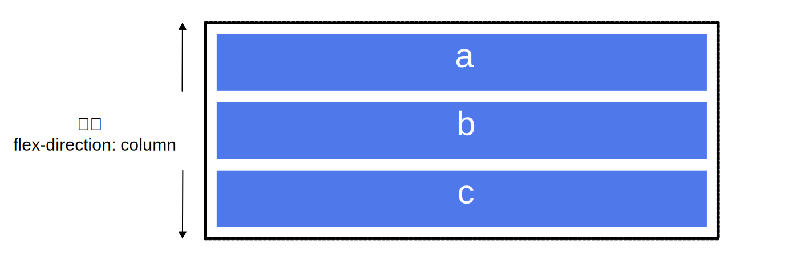
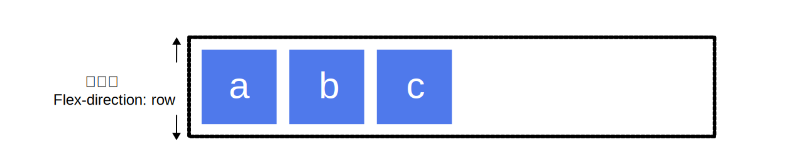
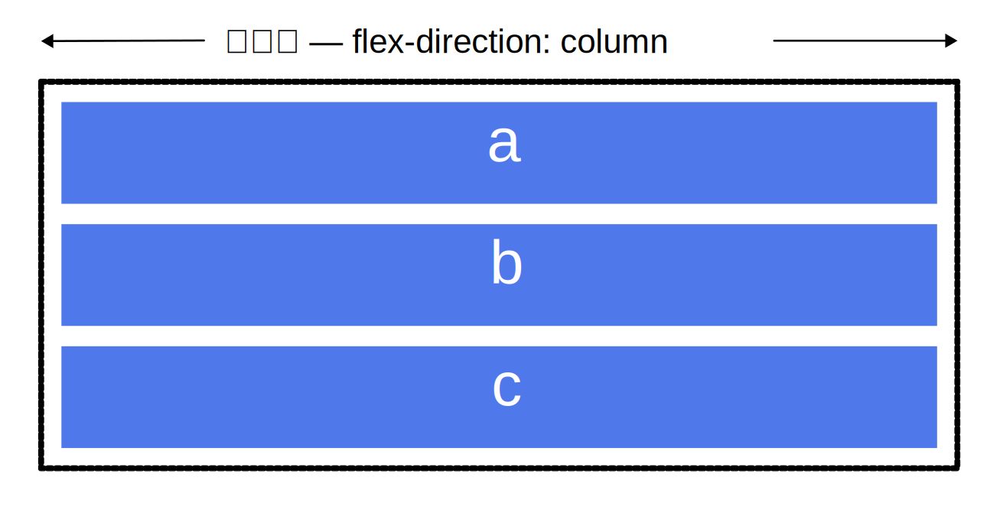
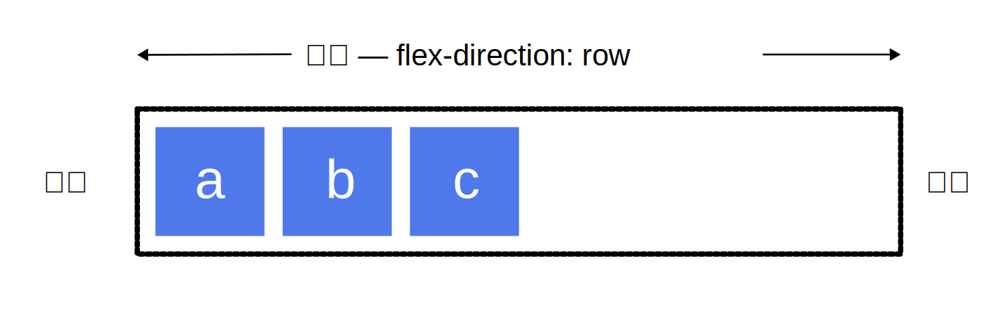

`Flexible Box`模型，通常被称为`flexbox`，是一种一维的布局模型。它给`flexbox`的子元素之间提供了强大的空间分布和对齐能力。

我们说flexbox是一种一维的布局，是因为一个flexbox一次只能处理一个维度上的元素布局，一行或者一列。作为对比的是另外一个二维布局`CSS Grid Layout`，可以同时处理行和列上的布局。

## Flexbox的两根轴线
`Flexbox`布局模型包含两个轴线：主轴（main axis）和交叉轴（cross axis）。主轴是元素在容器中的主要方向，由`flex-direction`属性定义，交叉轴是主轴的垂直方向。使用flexbox的所有属性都跟这两根轴有关。

### 主轴
`flex-direction`属性定义了主轴，取值如下：

* `row`：主轴为水平方向，默认值。
* `row-reverse`：主轴为水平方向，但方向相反。
* `column`：主轴为垂直方向。
* `column-reverse`：主轴为垂直方向，但方向相反。




### 交叉轴
交叉轴垂直于主轴。




`flexbox的特性是沿着主轴或者交叉轴对齐其中的元素`。

## 起始线和终止线



## flexbox容器
文档中采用了`flexbox`的区域就叫做`flex`容器。把一个容器的`display`属性值设置为`flex或者inline-flex`，就创建了flex容器。完成这一步之后，容器中的直系子元素就会变为flex元素。由于所有 CSS属性都会有一个初始值，所以flex容器中的所有flex元素都会有下列行为：

* 元素排列为一行（flex-direction属性默认值row）。
* 元素从主轴的起始线开始。
* 元素不会在主维度方向拉伸，但是可以缩小。
* 元素被拉伸来填充交叉轴大小。
* flex-basis属性为auto。
* flex-wrap属性为nowrap。

### 更改flex方向

```css
.box {
    display: flex;
    border: 2px dotted rgb(96 139 168);
    /* flex-direction: row-reverse; */
    flex-direction: column;
}
```

## 用flex-wrap属性实现多行flex容器
设置flex-wrap属性为wrap，元素会自动换行。

## 简写属性flex-flow
可以将两个属性`flex-direction`和`flex-wrap`组合为简写属性`flex-flow`。第一个指定的值为 flex-direction（即row, row-reverse, column 或 column-reverse），第二个指定的值为flex-wrap（即nowrap, wrap或 wrap-reverse）。

## flex元素上的属性
为了更好地控制flex元素，有三个属性可以作用于它们：

* flex-basis
* flex-grow
* flex-shrink


`可用空间（available space）`：flex容器里除了flex元素所占的空间以外的富余空间就是可用空间。这几个flex属性的作用其实就是改变了flex容器中的可用空间的行为。同时，可用空间对于flex元素的对齐行为也是很重要的。

### flex-basis
`flex-basis`默认值为`auto`。如果给元素设定了固定宽度，`flex-basic`属性的值就会变成这个固定宽度。如果元素没有设定固定宽度，`flex-basic`属性的值就会变成元素内容所占的宽度。

### flex-grow
flex-grow属性是处理flex元素在主轴上增加空间的问题。flex元素会以flex-basis为基础，沿主轴方向增长尺寸。

### flex-shrink
flex-shrink属性是处理flex元素收缩的问题。

### flex属性简写
`flex-grow`，`flex-shrink`和`flex-basis`属性很少单独使用，而是混合着写在`flex`简写形式中。 Flex简写形式允许你把三个数值按这个顺序书写 — flex-grow，flex-shrink，flex-basis。

大多数情况下可以用预定义的简写形式，下面是几种预定义的值：

* `flex:initial` 是把flex元素重置为Flexbox的初始值，它相当于`flex: 0 1 auto`。flex元素可以收缩。
* `flex:auto`等同于`flex: 1 1 auto；`和上面的flex:initial基本相同，但是这种情况下，flex元素在需要的时候既可以拉伸也可以收缩。
* `flex:none`可以把flex 素设置为不可伸缩。它和设置为`flex: 0 0 auto`是一样的。元素既不能拉伸或者收缩，但是元素会按具有flex-basis:auto属性的flexbox进行布局。
* `flex:<positive-number>`:flex: 1 或者 flex: 2 等等。它相当于flex: 1 1 0 或者 flex: 2 1 0。元素可以在flex-basis为0的基础上伸缩。

## 元素间的对齐和空间分配
Flexbox的一个关键特性是能够设置flex元素沿主轴方向和交叉轴方向的对齐方式，以及它们之间的空间分配。

### align-items
`align-items`属性可以使元素在交叉轴方向对齐。align-items属性取值如下：

* stretch，默认值。
* flex-start
* flex-end
* center

### justify-content
`justify-content`属性用来使元素在主轴方向上对齐，主轴方向是通过flex-direction设置的方向。初始值是flex-start，元素从容器的起始线排列。justify-content属性取值如下：

* stretch
* flex-start
* flex-end
* center
* space-around
* space-between