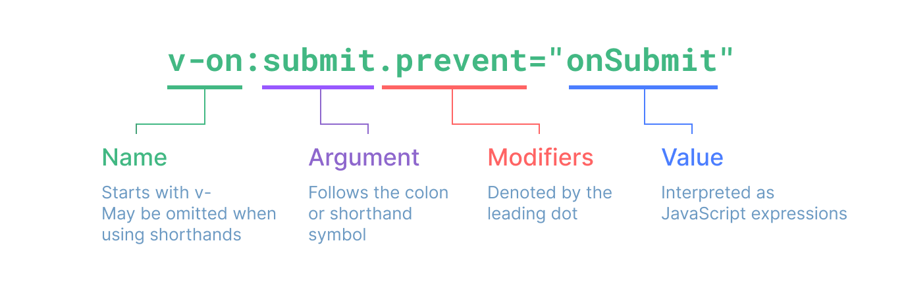

Vue使用一种基于HTML的模板语法。在底层机制中，Vue会将模板编译成高度优化的JavaScript代码。

## 文本插值
“Mustache”（胡子）语法，即双大括号。双大括号标签会被替换为Vue组件实例的msg属性值。

```html
 <span>Message: {{ msg }}</span>
```

## 原始HTML
双大括号会将数据解释为纯文本，而不是HTML。若想插入HTML，需要使用`v-html`指令。

```html
<!--解释为纯文本，原样输出-->
<p>Using text interpolation: {{ rawHtml }}</p>
<!--解释为HTML-->
<p>Using v-html directive: <span v-html="rawHtml"></span></p>
```

指令由`v-`作为前缀，表明它们是一些由Vue提供的特殊属性。

## 属性（Attribute）绑定
双大括号不能在HTML属性中使用，想要响应式的绑定一个属性，应该使用`v-bind`指令。

```html
<div v-bind:id="dynamicId"></div>
```

`v-bind`指令指示Vue将元素的id属性与组件的dynamicId属性保持一致。如果绑定的值是`null`或者`undefined`，那么该属性将会从渲染的元素上移除。

### 简写

```html
<div :id="dynamicId"></div>
```

### 同名简写，仅支持3.4版本及以上
如果属性的名称和绑定的JS变量的名称相同，则属性值可以省略。

```html
<!--与:id="id"相同-->
<div :id></div>

<!--或-->
<div v-bind:id></div>
```

### 布尔型属性
布尔型属性依据`true/false`值来决定属性是否应该存在于该元素上。

```html
<button :disabled="isDisabled">Button</button>
```

当isDisabled为真值或一个空字符串 (即 <button disabled="">) 时，元素的disabled属性启用。而当其为其他假值时属性将被忽略。

### 动态绑定多个值

```js
data() {
  return {
    objectOfAttrs: {
      id: 'container',
      class: 'wrapper',
      style: 'background-color:green'
    }
  }
}
```

通过不带参数的`v-bind`，将它们绑定到单个元素上：

```html
<div v-bind="objectOfAttrs"></div>
```

## 使用JS表达式
Vue在所有的数据绑定中都支持JS表达式。

```html
{{ number + 1 }}

{{ ok ? 'YES' : 'NO' }}

{{ message.split('').reverse().join('') }}

<div :id="`list-${id}`"></div>
```

在Vue模版内，JS表达式可以在以下场景使用：
* 在文本插值中 (双大括号)
* 在任何Vue指令 (以`v-`开头的特殊属性) 属性的值中

### 仅支持表达式
每个绑定仅支持单一表达式，也就是一段能够被求值的JS代码。

### 调用函数
可以在绑定的表达式中使用一个组件暴露的方法：

```html
<time :title="toTitleDate(date)" :datetime="date">
  {{ formatDate(date) }}
</time>
```

### 受限的全局访问
`模板中的表达式将被沙盒化，仅能够访问到有限的全局对象列表。该列表中会暴露常用的内置全局对象，比如 Math 和 Date。`

没有显式包含在列表中的全局对象将不能在模板内表达式中访问，例如用户附加在`window`上的属性。然而，你也可以自行在`app.config.globalProperties`上显式地添加它们，供所有的 Vue 表达式使用。

```vue
<template>
  <div>
    <h1>{{ $appName }}</h1>
    <p>{{ $filters.capitalize('hello world') }}</p>
    <button @click="$http()">发送请求</button>
  </div>
</template>

<script setup>
import { createApp } from 'vue'
import App from './App.vue'

const app = createApp(App)

// 添加全局属性
app.config.globalProperties.$appName = 'My Vue App'

// 添加全局工具函数
app.config.globalProperties.$filters = {
  capitalize: (value) => {
    if (!value) return ''
    value = value.toString()
    return value.charAt(0).toUpperCase() + value.slice(1)
  }
}

app.mount('#app')
</script>
```

## 指令
指令是带有`v-`前缀的特殊属性。
指令属性的期望值为一个JS表达式 (除了少数几个例外，即之后要讨论到的`v-for、v-on 和 v-slot`)。一个指令的任务是在其表达式的值变化时响应式地更新DOM。以`v-if`为例：

```html
<p v-if="seen">Now you see me</p>
```



### 参数
某些指令会需要一个“参数”，在指令名后通过一个冒号隔开做标识。例如用`v-bind`指令来响应式地更新一个HTML属性：

```html
<a v-bind:href="url"> ... </a>

<!-- 简写 -->
<a :href="url"> ... </a>
```

这里`href`就是一个参数，它告诉`v-bind`指令将表达式url的值绑定到元素的`href`属性上。在简写中，参数前的一切 (例如 v-bind:) 都会被缩略为一个`:`字符。
另一个例子是`v-on`指令，它将监听DOM事件：

```html
<a v-on:click="doSomething"> ... </a>

<!-- 简写 -->
<a @click="doSomething"> ... </a>
```

这里的参数是要监听的事件名称：`click`。v-on有一个相应的缩写，即`@`字符。

### 动态参数
在指令参数上也可以使用一个JS表达式，需要包含在`一对方括号内`：

```html
<!--
注意，参数表达式有一些约束，
参见下面“动态参数值的限制”与“动态参数语法的限制”章节的解释
-->
<a v-bind:[attributeName]="url"> ... </a>

<!-- 简写 -->
<a :[attributeName]="url"> ... </a>
```

这里的`attributeName`会作为一个JS表达式被动态执行，计算得到的值会被用作最终的参数。还可以将一个函数绑定到动态的事件名称上：

```html
<a v-on:[eventName]="doSomething"> ... </a>

<!-- 简写 -->
<a @[eventName]="doSomething"> ... </a>
```

在此示例中，当eventName的值是`focus`时，v-on:[eventName] 就等价于 v-on:focus。

### 动态参数值的限制
动态参数中表达式的值应当是一个`字符串`，或者是`null`。特殊值null意为显式移除该绑定。其他非字符串的值会触发警告。

### 动态参数语法的限制​
动态参数表达式因为某些字符的缘故有一些语法限制，比如空格和引号，在HTML属性名称中都是不合法的。例如下面的示例：

```html
<!-- 这会触发一个编译器警告 -->
<a :['foo' + bar]="value"> ... </a>

<a :[someAttr]="value"> ... </a>
```

* 在HTML属性名称中不能出现空格和引号等不合法字符
* 避免在名称中使用大写字母，因为浏览器会强制将其转换为小写

### 修饰符
修饰符是以点开头的特殊后缀，表明指令需要以一些特殊的方式被绑定。例如`.prevent`修饰符会告知`v-on`指令对触发的事件调用event.preventDefault()：

```html
<form @submit.prevent="onSubmit">...</form>
```
之后在讲到 v-on 和 v-model 的功能时，将会看到其他修饰符的例子。